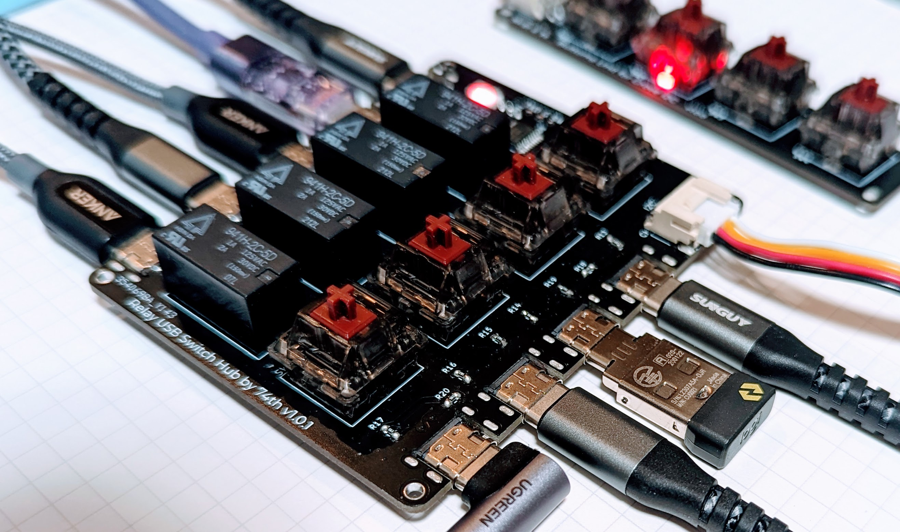

# Relay Switch USB 2.0 Hub

This is a USB hub with USB switching function using relays.

Many existing USB hubs with USB host switching function only allow 2-port switching, and I made this kit because we wanted a 4-port hub.
Since there are no USB hubs using USB Type-C available on the market, it is convenient to use USB Type-C.
Since I wanted to place the USB hub behind the display, we also added the ability to switch remotely using a Grove cable.

Usually a dedicated USB switching IC should be used for USB switching, but this is achieved by using a relay to switch between DM/DP. It works by me, so I am not guaranteeing that it works, but I am publishing it.

リレーを使った USB 切り替え機能付き USB ハブです。

既存の USB ホスト切り替え機能付き USB ハブでは、多くが 2 ポートしか切り替えられず、4 ポートが欲しかったため作りました。
USB Type-C を使った USB ハブは販売されていないため、USB Type-C が使えると便利です。
USB ハブはディスプレイの裏に置きたかったため、Grove ケーブルを使ってリモートから切り替えられる機能もつけました。

本来は USB 切り替えには USB 切り替え専用の IC を使うべきですが、これはリレーを使って DM/DP を切り替えることで実現しています。私の所では動作しているので、動作は保証しませんが、公開しています。

> Shop [BOOTH](https://74th.booth.pm/items/5080690)

## features

- Switch between 4 USB Hosts with Relay
- 4-port USB 2.0 hub using CH334
- MX compatible DIY keyboard switches can be used to switch between USB hosts
- Currently enabled USB host is indicated by LED color
- A Grove cable can be used to place a USB host switching switch at a remote location
- Power protection IC on both USB device and USB host side
- USB port next to LED for power supply
- All USB ports are Type-C

### Japanese

- リレーを使った USB ホスト切り替え機能
- CH334 を使った 4 ポート USB 2.0 ハブ
- USB ホストの切り替えスイッチには MX 互換自作キーボードスイッチが使える
- 現在有効な USB ホストを LED の色で表示する
- Grove ケーブルで、離れた位置に USB ホストを切り替えるスイッチを置くことができる
- USB デバイス、USB ホスト側の両方に電源保護 IC を搭載
- LED 横の USB ポートは電源供給用
- 全ての USB ポートは Type-C

## Repository Structure

- Relay USB Hub
  - PCB KiCad Data: [./main-pcb](./main-pcb)
  - Relay Control MCU Firmware(CH32V003F6P6): [./main-firmware](./main-firmware)
  - Case 3D Printer Model(WIP): [./case/case-bottom.stl](./case/case-bottom.stl)
- Button Unit Grove I2C
  - PCB KiCad Data: [./remote_switch-pcb](./remote_switch-pcb)
  - Button Unit MCU Firmware(CH32V003F6P6): [./remote_switch-firmware](./remote_switch-firmware)
  - Case 3D Printer Model(WIP): [./case/remote-bottom.stl](./case/remote-bottom.stl)

## About Using IC

- CH334R: USB 2.0 Hub controller IC
  - Product Site: https://www.wch-ic.com/products/CH334.html
  - Datasheet: https://www.wch-ic.com/downloads/CH334DS0_PDF.html
- CH32V003: Low Cost General Purpose MCU
  - Product Site: https://www.wch-ic.com/products/CH32V003.html
  - Datasheet: https://www.wch-ic.com/downloads/CH32V003DS0_PDF.html

## Relay USB Hub v1.0.1

- Semantics: [PDF](./main-pcb/relay_usb_switch_hub-v1.0.1-semantics.pdf) [Kicanvas](https://kicanvas.org/?github=https%3A%2F%2Fgithub.com%2F74th%2Frelay-switch-usbhub%2Fblob%2Fmain%2F1.0.1%2Fpcb%2Fusb_relay_hub.kicad_sch)
- PCB: [Kicanvas](https://kicanvas.org/?github=https%3A%2F%2Fgithub.com%2F74th%2Frelay-switch-usbhub%2Fblob%2Fmain%2F1.0.1%2Fpcb%2Fusb_relay_hub.kicad_pcb)

### BOM

| Reference          | Name                                             | Quantity |
| ------------------ | ------------------------------------------------ | -------- |
| C1, C3-C6, C8, C12 | Capacitor 0603 10uF                              | 7        |
| C2, C11            | Capacitor 0603 100nF                             | 2        |
| C7                 | NC                                               | 1        |
| C9, C10            | Capacitor 0603 22pF                              | 2        |
| CH2                | HY2.0 Socket SMD 4Pin - I2C                      | 1        |
| D1                 | RGBLED WS2812B                                   | 1        |
| D2-D5              | Fast Switching Diode SOD-123 1N4148W             | 4        |
| J1-J4              | USB Type-C Receptacle - USB Device               | 4        |
| J5                 | USB Type-C Receptacle - Power                    | 1        |
| J6-J9              | USB Type-C Receptacle - Com Host                 | 4        |
| K1-K4              | 5V 2 Form C Relay                                | 4        |
| R1-R10             | Register 0603 5.1kΩ                              | 10       |
| R11                | Register 0603 27Ω                                | 1        |
| R12                | Register 0603 10kΩ                               | 1        |
| R13-R20, R23-R26   | Register 0603 56kΩ                               | 12       |
| R21, R22           | Register 0603 1kΩ                                | 2        |
| SW1-SW4            | Cherry MX Compatible Switch or Kailh Choc Switch | 4        |
| U1-U4              | USB Power Protection IC SOT-23 CH213K            | 4        |
| U6                 | MCU LQFP48 WCH CH32V003F4P6                      | 1        |
| U7-U10             | USB Power Protection IC SOT-23-6L CH217K         | 4        |
| U11                | USB 2.0 Hub Controller QSOP-16 CH334R            | 1        |
| Y1                 | Crystal 3225 12MHz                               | 1        |

## Button Unit Grove v1.0.0

- Semantics: [PDF](./remote_switch-pcb/button_unit_grove_i2c-v1.0.0-semantics.pdf) [Kicanvas](https://kicanvas.org/?github=https%3A%2F%2Fgithub.com%2F74th%2Frelay-switch-usbhub%2Fblob%2Fbutton_unit_grove_i2c%2F1.0.0%2Fswitch-pcb%2Fswitch-pcb.kicad_sch)
- PCB: [Kicanvas](https://kicanvas.org/?github=https%3A%2F%2Fgithub.com%2F74th%2Frelay-switch-usbhub%2Fblob%2Fbutton_unit_grove_i2c%2F1.0.0%2Fswitch-pcb%2Fswitch-pcb.kicad_pcb)

### BOM

| Reference | Name                                             | Quantity |
| --------- | ------------------------------------------------ | -------- |
| C1        | Capacitor 0805 100nF                             | 1        |
| C2        | Capacitor 0805 10uF                              | 1        |
| CH1       | HY2.0 Socket SMD 4Pin - Grove I2C                | 1        |
| D1-D4     | RGBLED 3528 SK6812MINI-E                         | 4        |
| R1        | Register 0805 10kΩ                               | 1        |
| R2        | Register 0805 27Ω                                | 1        |
| SW1-SW4   | Cherry MX Compatible Switch or Kailh Choc Switch | 4        |
| U1        | MCU LQFP48 WCH CH32V003F4P6                      | 1        |

## License

MIT

日本では販売しないでいただけるとありがたいです。
